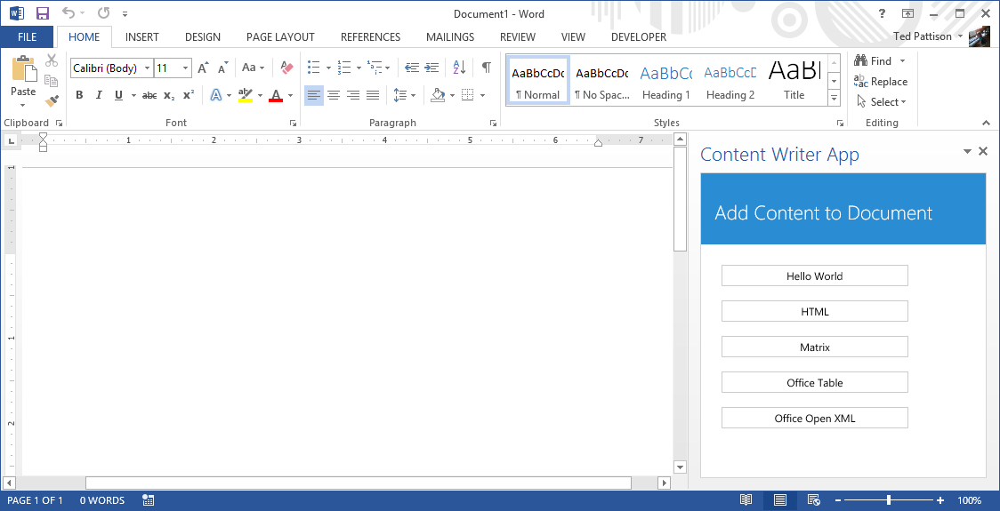
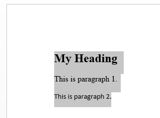
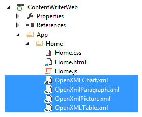
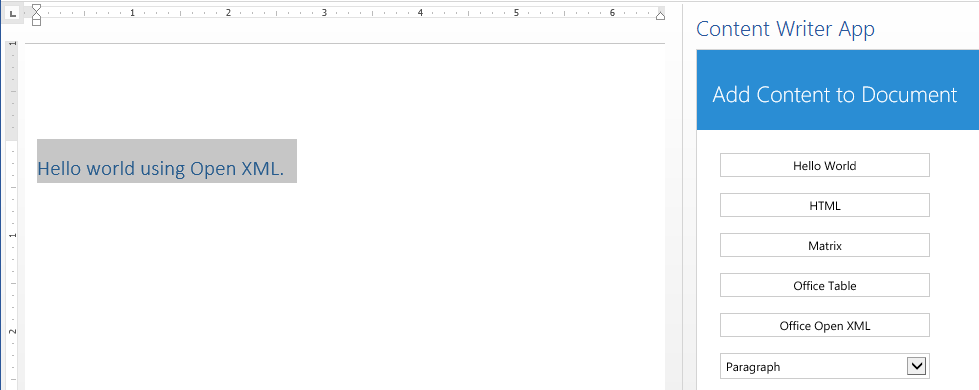
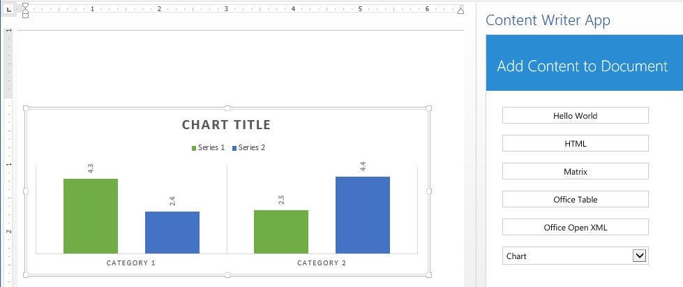

# Deep Dive into Office Word Add-ins
In this lab you will get hands-on experience developing an Office Word Add-in.

> **Note**: The name "apps for Office" is changing to "Office Add-ins". During the transition, the documentation and the UI of some Office host applications and Visual Studio tools might still use the term "apps for Office". For details, see [New name for apps for Office and SharePoint](https://msdn.microsoft.com/en-us/library/office/fp161507.aspx#bk_newname).

**Prerequisites:**

1. You must have an Office 365 tenant and Microsoft Azure subscription to complete this lab. If you do not have one, the lab for **O3651-7 Setting up your Developer environment in Office 365** shows you how to obtain a trial. You must also have access to an Exchange inbox within an Office 365 developer tenancy.
1. You must have the Office 365 API Tools version 1.4.50428.2 installed in Visual Studio 2013 & Update 4 installed.
1. In order to complete exercise 4, you must have Office 2016 Preview installed which you can obtain from here: https://products.office.com/en-us/office-2016-preview

## Exercise 1: Creating the ContentWriter Add-in Office Project
*In this exercise you will create a new Office Add-in project in Visual Studio so that you can begin to write, test and debug an Office Word Add-in. The user interface of the Office Add-in you will create in this lab will not be very complicated as it will just contain HTML buttons and JavaScript command handlers.*

1. Launch Visual Studio 2013 as administrator.
1. From the **File** menu select the **New Project** command. When the **New Project** dialog appears, select the **App for Office** project template from the **Office/SharePoint** template folder as shown below. Name the new project **ContentWriter** and click **OK** to create the new project.

	

1. When you create a new App for Office project, Visual Studio prompts you with the **Choose the app type** page of the **Create app for Office** dialog. This is the point where you select the type of App for Office you want to create. Leave the default setting with the radio button titled **Task pane** and select **OK** to continue.

	

1. On the **Choose the host applications** page of the **Create app for Office** dialog, uncheck all the Office application except for **Word** and then click **Finish** to create the new Visual Studio solution. 

	

1. Take a look at the structure of the new Visual Studio solution once it has been created. At a high-level, the new solution has been created using two Visual Studio projects named **ContentWriter** and **ContentWriterWeb**. You should also observe that the top project contains a top-level manifest for the app named **ContentWriterManifest** which contains a single file named **ContentWriter.xml**.

	

1. In the Solution Explorer, double-click on the node named **ContentWriterManifest** to open the app manifest file in the Visual Studio designer. Update the **Display Name** settings in the app manifest from **ContentWriter** to **Content Writer App**.

	

1. Save and close **ContentWriterManifest**.
1. Over the next few steps you will walk through the default app implementation that Visual Studio generated for you when the app project was created. Begin by looking at the structure of the **app** folder which has two important files named **app.css** and **app.js** which contain CSS styles and JavaScript code which is to be used on an app-wide basis.

	

1. You can see that inside the **app** folder there is a child folder named **Home** which contains three files named **Home.html**, **Home.css** and **Home.js**. Note that the app project is currently configured to use **Home.html** as the app's start page and that **Home.html** is linked to both **Home.css** and **Home.js**.
 
1. Double-click on **app.js** to open it in a code editor window. you should be able to see that the code creates a global variable named **app** based on the JavaScript *Closure* pattern. The global **app** object defines a method named **initialize** but it does not execute this method. 

	````javascript 
	var app = (function () {
	  "use strict";

	  var app = {};

	  // Common initialization function (to be called from each page)
	  app.initialize = function () {
	    $('body').append(
		  '<div id="notification-message">' +
		  '<div class="padding">' +
		  '<div id="notification-message-close"></div>' +
		  '<div id="notification-message-header"></div>' +
		  '<div id="notification-message-body"></div>' +
		  '</div>' +
		  '</div>');

		  $('#notification-message-close').click(function () {
		    $('#notification-message').hide();
		  });


		  // After initialization, expose a common notification function
		  app.showNotification = function (header, text) {
		    $('#notification-message-header').text(header);
		    $('#notification-message-body').text(text);
		    $('#notification-message').slideDown('fast');
		  };
		};

		  return app;
	})();
	````

1. Close **app.js** and be sure not to save any changes.
1. Next you will examine the JavaScript code in **home.js**. Double-click on **home.js** to open it in a code editor window. Note that **Home.html** links to **app.js** before it links to **home.js** which means that JavaScript code written in **Home.js** can access the global **app** object created in **app.js**.
1. Walk through the code in **Home.js** and see how it uses a self-executing function to register an event handler on the **Office.initialize** method which in turn registers a document-ready event handler using jQuery. This allows the app to call **app.initialize** and to register an event handler using the **getDataFromSelection** function. 

	````javascript 
	(function () {
	  "use strict";

	  // The initialize function must be run each time a new page is loaded
	  Office.initialize = function (reason) {
	    $(document).ready(function () {
	      app.initialize();
	      $('#get-data-from-selection').click(getDataFromSelection);
	    });
	  };

	  // Reads data from current document selection and displays a notification
	  function getDataFromSelection() {
	    Office.context.document.getSelectedDataAsync(Office.CoercionType.Text,
	      function (result) {
	        if (result.status === Office.AsyncResultStatus.Succeeded) {
	          app.showNotification('The selected text is:', '"' + result.value + '"');
	        } else {
	          app.showNotification('Error:', result.error.message);
	      }
		});
	  }
	})();
	````

1. Delete the **getDataFromSelection** function from **Home.js** and also remove the line of code that binds the event handler to the button with the id of **get-data-from-selection** so your code matches the following code listing.

	````javascript
	(function () {
	  "use strict";

	  // The initialize function must be run each time a new page is loaded
	  Office.initialize = function (reason) {
	    $(document).ready(function () {
	      app.initialize();
	      // your app initialization code goes here
	    });
	  };

	})(); 
	````

1. Save your changes to **Home.js**. You will return to this source file after you have added your HTML layout to **Home.html**.
1. Now it time to examine the HTML that has been added to the project to create the app's user interface. Double-click **Home.html** to open this file in a Visual Studio editor window. Examine the layout of HTML elements inside the body element. 

	````html
	<body>
		<div id="content-header">
			<div class="padding">
				<h1>Welcome</h1>
			</div>
		</div>
		<div id="content-main">
			<div class="padding">
				<p><strong>Add home screen content here.</strong></p>
				<p>For example:</p>
				<button id="get-data-from-selection">Get data from selection</button>

				<p style="margin-top: 50px;">
					<a target="_blank" href="https://go.microsoft.com/fwlink/?LinkId=276812">Find more samples online...</a>
				</p>
			</div>
		</div>
	</body>
	````

1. Replace the text message of **Welcome** inside the **h1** element with a different message such as **Add Content to Document**. Also trim down the contents of the **div** element with the **id** of **content-main** to match the HTML code shown below. 

	````html
	<body>
		<div id="content-header">
			<div class="padding">
				<h1>Add Content to Document</h1>
			</div>
		</div>
		<div id="content-main">
			<div class="padding">
				<!-- your app UI layout goes here -->
			</div>
		</div>
	</body>
	````

1. Update the **content-main** div to match the following HTML layout which adds a set of buttons to the app's layout.

	````html
	<div id="content-main">
		<div class="padding">
			<div>
				<button id="addContentHellowWorld">Hello World</button>
			</div>
			<div>
				<button id="addContentHtml">HTML</button>
			</div>
			<div>
				<button id="addContentMatrix">Matrix</button>
			</div>
			<div>
				<button id="addContentOfficeTable">Office Table</button>
			</div>
			<div>
				<button id="addContentOfficeOpenXml">Office Open XML</button>
			</div>
		</div>
	</div>
	````

1. Save and close **Home.html**.
1. Open the CSS file named **Home.css** and add the following CSS rule to ensure all the app's command buttons and select element have a uniform width and spacing.

	````css
	#content-main button, #content-main select{
			width: 210px;
			margin: 8px;
	}
	````

1. Save and close **Home.js**.
1. Now it's time to test the app using the Visual Studio debugger. Press the **{F5}** key to run the project in the Visual Studio debugger. The debugger should launch Microsoft Word 2013 and you should see your App for Office in the task pane on the right side of a new Word document as shown in the following screenshot.

	

1. Close Microsoft Word to terminate your debugging session and return to Visual Studio.
1. Return to the source file named **Home.js** or open it if it is not already open.
1. Add a new function named **testForSuccess** with the following implementation.

	````javascript
	function testForSuccess(asyncResult) {
		if (asyncResult.status === Office.AsyncResultStatus.Failed) {
			app.showNotification('Error', asyncResult.error.message);
		}
	}
	````

1. Create a function named **onAddContentHellowWorld** and add the following call to **setSelectedDataAsync**.

	````javascript
	function onAddContentHellowWorld() {
		Office.context.document.setSelectedDataAsync("Hello World!", testForSuccess);
	}
	````

1. Finally, add a line of jQuery code into the app initialization logic to bind the click event of the **addContentHellowWorld** button to the **onAddContentHellowWorld** function.

	````javascript
	Office.initialize = function (reason) {
		$(document).ready(function () {
			app.initialize();
			// add this code to wire up event handler
			$("#addContentHellowWorld").click(onAddContentHellowWorld)
		});
	};
	````

1. When you are done, the **Home.js** file should match the following listing.

	````javascript
	(function () {
		"use strict";

		// The initialize function must be run each time a new page is loaded
		Office.initialize = function (reason) {
			$(document).ready(function () {
				app.initialize();
				// wire up event handler
				$("#addContentHellowWorld").click(onAddContentHellowWorld)
			});
		};

		// write text data to current at document selection 
		function onAddContentHellowWorld() {
			Office.context.document.setSelectedDataAsync("Hello World!", testForSuccess);
		}

		function testForSuccess(asyncResult) {
			if (asyncResult.status === Office.AsyncResultStatus.Failed) {
				app.showNotification('Error', asyncResult.error.message);
			}
		}

	})();
	````

1. Save your changes to **Home.js**.
1. Now test the functionality of the app. Press the **{F5}** key to begin a debugging session and click the **Hello World** button. You should see that "Hello World" has been added into the cursor position of the Word document.

	

1. You have now successfully run and tested the app and its JavaScript logic using the Visual Studio debugger. Close Microsoft Word to stop the debugging session and return to Visual Studio.

## Exercise 2: Writing Content to a Word Document Using Coercion Types
*In this exercise you will continue working on the Visual Studio solution for the ContentWriter app you created in the previous exercise. You will add additional JavaScript code to insert content into the current Word document in a variety of formats.*
 
1. In Visual Studio, make sure you have the **ContentWriter** project open.
1. In the Solution Explorer, double click on **Home.js** to open this JavaScript file in an editor window. 
1. Just below the **onAddContentHelloWorld** function, add four new functions named **onAddContentHtml**, **onAddContentMatrix**, **onAddContentOfficeTable** and **onAddContentOfficeOpenXml**.

	````javascript
	function onAddContentHellowWorld() {
		Office.context.document.setSelectedDataAsync("Hello World!", testForSuccess);
	}

	function onAddContentHtml() {
	}

	function onAddContentMatrix() {
	}

	function onAddContentOfficeTable() {
	}

	function onAddContentOfficeOpenXml() {
	}
	````

1. Just below the call to **app.initialize**, add the jQuery code required to bind each of the four new functions to the **click** event of the associated buttons.
   
	````javascript
	Office.initialize = function (reason) {
		$(document).ready(function () {
			app.initialize();
			// wire up event handler
			$("#addContentHellowWorld").click(onAddContentHellowWorld);
			$('#addContentHtml').click(onAddContentHtml);
			$('#addContentMatrix').click(onAddContentMatrix);
			$('#addContentOfficeTable').click(onAddContentOfficeTable);
			$('#addContentOfficeOpenXml').click(onAddContentOfficeOpenXml);
		});
	};
	````

1. Implement the **onAddContentHtml** function to create an HTML div element with several child elements using jQuery and then to write that HTML to the Word document using the HTML coercion type using the code in the following listing.

	````javascript
	function onAddContentHtml() {
		// create HTML element
		var div = $("<div>")
				.append($("<h2>").text("My Heading"))
				.append($("<p>").text("This is paragraph 1"))
				.append($("<p>").text("This is paragraph 2"))

		// insert HTML into Word document
		Office.context.document.setSelectedDataAsync(div.html(), { coercionType: "html" }, testForSuccess);
	}
	````

1. Test your work by starting a debug session and clicking the **HTML** button. When you click the button, you should see that the HTML content has been added to the Word document.

	

1. Implement **onAddContentMatrix** by creating an array of arrays and then by writing the matrix to the Word document using the matrix coercion type as shown in the following code listing.

	````javascript
	function onAddContentMatrix() {
		// create matrix as an array of arrays
		var matrix = [["First Name", "Last Name"],
	                  ["Bob", "White"],
	                  ["Anna", "Conda"],
	                  ["Max", "Headroom"]];

		// insert matrix into Word document
		Office.context.document.setSelectedDataAsync(matrix, { coercionType: "matrix" }, testForSuccess);
	}
	````

1. Test your work by starting a debug session and clicking the **Matrix** button. When you click the button, you should see that the content from the matrix has been added to the Word document as a table.

	

1. Implement **onAddContentOfficeTable** by creating a new Office.TableData object  and then by writing it to the Word document using the table coercion type as shown in the following code listing.

	````javascript
	function onAddContentOfficeTable() {

		// create and populate an Office table
		var myTable = new Office.TableData();
		myTable.headers = [['First Name', 'Last Name']];
		myTable.rows = [['Bob', 'White'], ['Anna', 'Conda'], ['Max', 'Headroom']];

		// add table to Word document
		Office.context.document.setSelectedDataAsync(myTable, { coercionType: "table" }, testForSuccess)
	}
	````

1. Test your work by starting a debug session and clicking the **Office Table** button. When you click the button, you should see that the content from the Office Table object has been added to the Word document as a table.

	

1. You have now finished exercise 2 and it is time to move on to exercise 3.

## Exercise 3: Writing Content to a Word Document using Office Open XML
*In this exercise you will continue working on the Visual Studio solution for the ContentWriter app you worked on in the previous exercise. You will extend the app's capabilities by adding JavaScript code to insert content into the active Word document using Open Office XML.*

1. Look inside the folder for this lab and locate the child folder named **Starter Files**. You should see that this folder contains four XML files as shown in the following screenshot.

	

1. Add the four XML files into the Visual Studio project into the same folder as the HTML start page named **Home.html**.

	

1. Quickly open and review the XML content inside each of these four XML files. This will give you better idea of what Open Office XML looks like when targeting Microsoft Word. 
1. Open **Home.html** and locate the button element with the id of **addContentOfficeOpenXml**. Directly under this button, add a new HTML **select** element as shown in the following code listing.

	````html
	<div>
	  <button id="addContentOfficeOpenXml">Office Open XML</button>
	  <select id="listOpenXmlContent">
	    <option value="OpenXmlParagraph.xml">Paragraph</option>
	    <option value="OpenXmlPicture.xml">Picture</option>
	    <option value="OpenXmlChart.xml">Chart</option>
	    <option value="OpenXmlTable.xml">Table</option>
	  </select>
	</div>
	````

1. Save and close **Home.html**.
1. Return to the code editor window with **Home.js**. 
1. Implement the **onAddContentOfficeOpenXml** function to obtain the currently selected file name from the select element and then to execute an HTTP GET request using the jQuery **$.ajax** function to retrieve the associated XML file. In the success callback function, call **setSelectedDataAsync** to write the XML content to the current Word document using the **ooxml** coercion type as shown in the following code listing.

	````javascript
	function onAddContentOfficeOpenXml() {
		var fileName = $("#listOpenXmlContent").val();

		$.ajax({
			url: fileName,
			type: "GET",
			dataType: "text",
			success: function (xml) {
				Office.context.document.setSelectedDataAsync(xml, { coercionType: "ooxml" }, testForSuccess)
			}
		});
	}
	````

1. Test your work by starting a debug session and clicking the **Office Open XML** button when the select element has the default selected value of **Paragraph**. You should see that the Open Office XML content has been used to created a formatted paragraph.

	

1. Change the value of the select element to **Picture** and click the **Office Open XML** button. You should see that the Open Office XML content has been used to insert a image into the document.

	

1. Change the value of the select element to **Chart** and click the **Office Open XML** button. You should see that the Open Office XML content has been used to created a simple bar chart.
	
	

1. Change the value of the select element to **Table** and click the **Office Open XML** button. You should see that the Open Office XML content has been used to created a formatted table.

	

Congratulations! In this exercise you extended the add-in's capabilities by adding JavaScript code to insert content into the active Word document using Open Office XML.

## Exercise 4: Leverage the Word v2 JavaScript API in Word 2016
In this exercise you will create a Word Add-in that uses the v2 JavaScript API included in Word 2016. 

> **Note**: For this exercise you must have Word 2016 Preview, or a later version, installed. Refer to the prerequisites at the beginning of this lab for links on where to obtain Office 2016 Preview.

1. Launch Visual Studio 2013 as administrator.
1. From the **File** menu select the **New Project** command. When the **New Project** dialog appears, select the **App for Office** project template from the **Office/SharePoint** template folder as shown below. Name the new project **Word16Api** and click **OK** to create the new project.

1. When you create a new App for Office project, Visual Studio prompts you with the **Choose the app type** page of the **Create app for Office** dialog. This is the point where you select the type of App for Office you want to create. Leave the default setting with the radio button titled **Task pane** and select **OK** to continue.

	

1. On the **Choose the host applications** page of the **Create app for Office** dialog, uncheck all the Office application except for **Word** and then click **Finish** to create the new Visual Studio solution. 

	

1. Reference the Word 2016 v2 JavaScript API in the add-in:
	1. Locate and open the homepage for the add-in: **App \ Home \ Home.html**.
	1. Immediately after the reference to `Office.js` in the `<head>` portion of the page, add the following two script references to the Word v2 JavaScript API:

		````html
		<script src="https://oep.azurewebsites.net/preview/4229.1002/office.runtime.js" 
		        type="text/javascript"></script>
		<script src="https://oep.azurewebsites.net/preview/4229.1002/word.js" 
		        type="text/javascript"></script>
		````

	> **Note:** Eventually the Word v2 JavaScript API will be merged into the single `Office.js` file so this step will not be necessary, but in the preview timeframe it is required as an extra step.

1. Now update the user interface for the add-in:
	1. Locate the `<body>` section of the page within the `home.html` file.
	1. Replace the entire contents of the `<body>` with the following markup:

		````html
		<body>
		  <div id="content-header">
		    <div class="padding">
		      <h1>Welcome</h1>
		    </div>
		  </div>
		  <div id="content-main">
		    <div class="padding">
		      <button id="addBibliography">Add Bibliography</button>
		      <button id="highlightInstances">Highlight Instances of "Word"</button>
		    </div>
		  </div>
		</body>
		````

1. The next step is to code the business logic for the add-in.
	1. Locate the **App \ Home \ Home.html** file.
	1. Remove all the sample code except the add-in initialization code so all that is left is the following:

		````javascript
		(function () {
		  "use strict";

		  // The initialize function must be run each time a new page is loaded
		  Office.initialize = function (reason) {
		    $(document).ready(function () {
		      app.initialize();

		      // attach click handlers to the word document
		      // TODO-1
		      // TODO-2
		    });
		  };

		  // TODO-error
		})();
		````

	1. Add a universal error handler function that will be used when there are errors. This should replace the comment `// TODO-error`:

		````javascript
	  function errorHandler (error) {
	    console.log("Failed: ErrorCode=" + error.errorCode + ", ErrorMessage=" + error.errorMessage);
	    console.log(error.traceMessages);
	  }
		````

	1. Now add a function that will add a bibliography to the end of the current Word document:
		1. Replace the comment `// TODO-1` with the following jQuery code that creates a click event handler on one of the buttons in the `home.html` page you added previously:

			````javascript
			$('#addBibliography').click(addBibliography);
			````

		1. Next, add the following function before the error handler function you added previously.

			Notice how the code in this function is very different from the code in the previous exercises. The Word v2 JavaScript API uses a context (`Word.RequestContext()`) to allow you to batch multiple operations (such as `context.document.body.insertParagraph()`) that will be sent to the hosting Word client application for processing at one time using the `context.executeAsync()` method:

			````javascript
		  function addBibliography() {
		    // get reference to hosting Word application
		    var context = new Word.RequestContext();

		    // insert a H1 for the new paragraph to the end of the document
		    var bibliographyParagraph = context.document.body.insertParagraph("Bibliography", "end");
		    bibliographyParagraph.style = "Heading 1";

		    // create one book entry
		    var bookOneTitle = context.document.body.insertParagraph("Design Patters, Elements of Reusable Object-Oriented Software", "end");
		    bookOneTitle.style = "Book Title";
		    var bookOneAuthors = context.document.body.insertParagraph("by Erich Gamma, Richard Helm, Ralph Johnson and John Vlissides", "end");
		    bookOneAuthors.style = "Subtle Emphasis";

		    // create another book entry
		    var bookTwoTitle = context.document.body.insertParagraph("Refactoring: Improving the Design of Existing Code", "end");
		    bookTwoTitle.style = "Book Title";
		    var bookTwoAuthors = context.document.body.insertParagraph("by Martin Fowler", "end");
		    bookTwoAuthors.style = "Subtle Emphasis";

		    // execute queued operations
		    context.executeAsync().then(function () { }, errorHandler);
		  };
			````

	1. Finally, add another function that will search and highlight a string within the current Word document. In this case we will search for the text **Word**.
		1. Replace the comment `// TODO-2` with the following jQuery code that creates a click event handler on one of the buttons in the `home.html` page you added previously:

			````javascript
			$('#highlightInstances').click(highlightInstances);
			````

		1. Next, add the following function before the error handler you added previously.

			Notice how this code gets a Word context, creates a search options object and executes a search query against Word. It then uses the `context.references` collection to tell Word to take all the items in this collection and assign unique ID's to them so you can target them. You then use these targets to change the highlight color on the word.Finally you remove all the references from memory:

			````javascript
		  function highlightInstances() {
		    // get reference to hosting Word application
		    var context = new Word.RequestContext();

		    // create search options
		    var options = Word.SearchOptions.newObject(context);
		    options.matchCase = true;

		    // get all instances of the word 'Word' in the document
		    var results = context.document.body.search("Word", options);
		    context.load(results);

		    // establish ID's for each of the items in the results
		    context.references.add(results);

		    // execute queued operations
		    context.executeAsync().then(
		        function () {
		          // for all instances found...
		          for (var i = 0; i < results.items.length; i++) {
		            // highlight the item in the document
		            results.items[i].font.highlightColor = "#FFFF00";
		          }

		          // remove all the references
		          context.references.remove(results);
		          // execute queued operations
		          context.executeAsync();
		        }, errorHandler);
		  };
			````

###Test the Add-in
1. Now deploy the Word Add-in to the local Word client:
  1. Select the **Word16Api** project within the **Solution Explorer** tool window.
  1. Within the **Properties** window set the **Start Action** selector to **Office Desktop Client** and press **F5** to start the project.
  1. Visual Studio will launch the Word desktop client & create a new Word document.
1. Type the following into the Word document and press **ENTER** to add some random text:

	````
	=rand()
	````

1. First test the insertion of content by pressing the button **Add Bibliography**. You should see a heading followed by two classic programming books added to the document.
1. Now test the search & highlight function you wrote by pressing the button **Highlight Instances of "Word"**. You should see all instances of the whole word **Word** get highlighted in yellow.

Congratulations! You've now written a Word Add-in that uses the new Word v2 JavaScript API.


